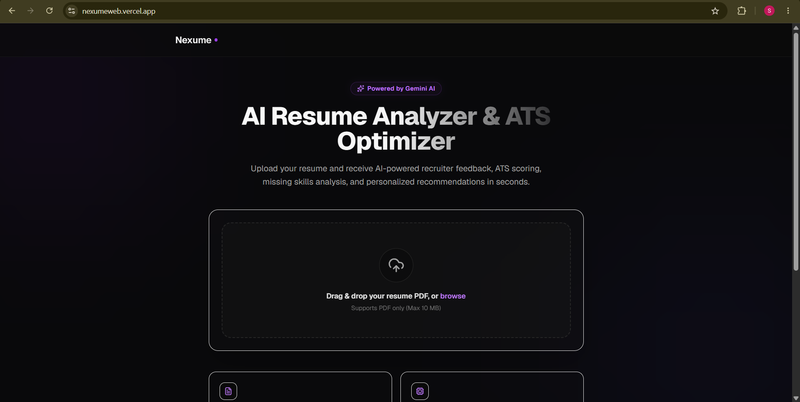
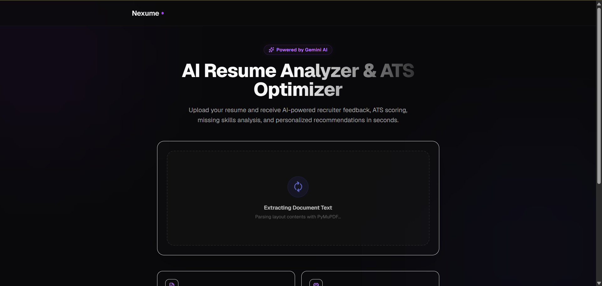
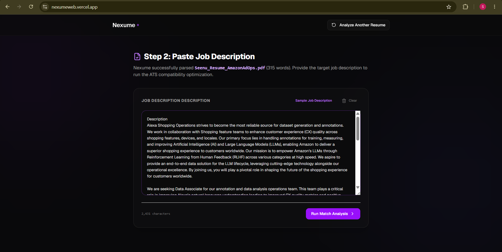
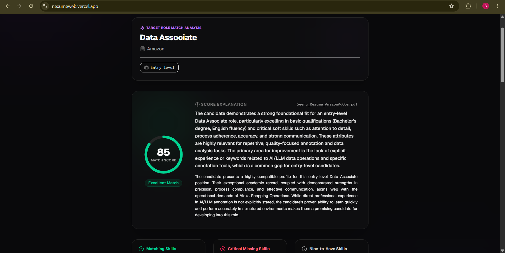

<div align="center">

# Nexume

### AI-Powered ATS Resume Analyzer & Job Match Platform

Upload your resume, compare it against real job descriptions, receive recruiter-style AI feedback, ATS compatibility scores, identify skill gaps, and get actionable recommendations to improve your chances of landing interviews.

Built with **React**, **FastAPI**, **Google Gemini**, and **PyMuPDF**.

🌐 **Live Demo:** https://nexumeweb.vercel.app

</div>

---

# Overview

Nexume is an AI-powered ATS optimization platform that helps job seekers tailor their resumes for specific job opportunities.

Unlike traditional resume analyzers, Nexume doesn't only evaluate your resume—it compares it against a target job description and generates recruiter-style insights similar to modern Applicant Tracking Systems (ATS).

The application extracts structured text from PDF resumes using **PyMuPDF**, leverages **Google Gemini** for intelligent analysis, and presents an interactive dashboard highlighting resume quality, ATS compatibility, skill gaps, keyword coverage, and personalized recommendations.

The project follows a clean architecture where PDF processing, AI orchestration, prompt engineering, business logic, and presentation layers remain modular and independently maintainable.

---

# Features

## Resume Processing

- Upload PDF resumes
- Drag & Drop upload interface
- Secure PDF validation
- PDF text extraction using PyMuPDF

## AI Resume Analysis

- ATS Resume Score
- Professional Summary
- Resume Strengths
- Resume Weaknesses
- Missing Skills Detection
- Personalized Recommendations

## Job Description Matching

- Paste Target Job Description
- ATS Match Score
- Resume vs Job Comparison
- Matching Skills
- Missing Skills
- Missing Keywords
- Experience Gap Analysis
- Education Fit Analysis
- Tailored Improvement Suggestions

## User Experience

- Modern Responsive Dashboard
- Multi-step Analysis Workflow
- Real-time Upload Progress
- Clean Recruiter-style UI
- REST API powered by FastAPI
- Deployable on Vercel + Render

---

# Tech Stack

## Frontend

- React
- TypeScript
- Vite
- Tailwind CSS
- shadcn/ui
- Lucide Icons

## Backend

- FastAPI
- Python
- Pydantic
- PyMuPDF
- Uvicorn

## AI

- Google Gemini 2.5 Flash
- Structured JSON Responses
- Prompt Engineering
- ATS Resume Evaluation
- Job Description Matching

## Deployment

- Vercel
- Render

---

# Architecture

```text
                      +----------------------+
                      |      React UI        |
                      +----------+-----------+
                                 |
              Resume PDF + Job Description
                                 |
                                 ▼
                     +----------------------+
                     |    FastAPI Backend   |
                     +----------+-----------+
                                |
                +---------------+---------------+
                |                               |
                ▼                               ▼
        PDFExtractor                    Match Service
         (PyMuPDF)                              |
                |                               |
                +-------------+-----------------+
                              |
                              ▼
                      Google Gemini AI
                              |
                              ▼
                 Structured ATS Analysis
                              |
                              ▼
                  Interactive Dashboard
```

---

# Project Structure

```text
nexume
│
├── backend
│   ├── app
│   │   ├── api
│   │   ├── core
│   │   ├── prompts
│   │   ├── schemas
│   │   ├── services
│   │   ├── utils
│   │   └── main.py
│   │
│   ├── requirements.txt
│   └── .env.example
│
├── frontend
│   ├── src
│   │   ├── components
│   │   ├── services
│   │   ├── assets
│   │   └── App.tsx
│   │
│   ├── package.json
│   └── .env.example
│
└── README.md
```

---

# Getting Started

## 1. Clone the Repository

```bash
git clone https://github.com/SeenuBommisetti/nexume.git

cd nexume
```

---

# Backend Setup

Navigate to the backend folder.

```bash
cd backend
```

Create a virtual environment.

```bash
python -m venv .venv
```

Activate the environment.

### Windows

```bash
.venv\Scripts\activate
```

### macOS / Linux

```bash
source .venv/bin/activate
```

Install dependencies.

```bash
pip install -r requirements.txt
```

Create a `.env` file.

```env
GEMINI_API_KEY=YOUR_API_KEY
GEMINI_MODEL=gemini-2.5-flash
```

Run the backend.

```bash
uvicorn app.main:app --reload
```

Backend runs at:

```
http://localhost:8000
```

---

# Frontend Setup

Navigate to the frontend.

```bash
cd frontend
```

Install dependencies.

```bash
npm install
```

Create `.env`.

```env
VITE_API_BASE_URL=http://localhost:8000
```

Run the frontend.

```bash
npm run dev
```

Frontend runs at:

```
http://localhost:5173
```

---

# Environment Variables

## Backend

| Variable | Description |
|----------|-------------|
| GEMINI_API_KEY | Google Gemini API Key |
| GEMINI_MODEL | Gemini Model |

## Frontend

| Variable | Description |
|----------|-------------|
| VITE_API_BASE_URL | Backend URL |

---

# API Endpoints

## Health Check

```http
GET /api/v1/health
```

Returns backend status information.

---

## Resume Upload & Analysis

```http
POST /api/v1/resume/upload
```

Uploads a PDF resume, extracts text, and generates an AI-powered resume analysis.

### Response

```json
{
  "resume": {
    "filename": "resume.pdf",
    "page_count": 1,
    "word_count": 420,
    "text": "..."
  },
  "analysis": {
    "overall_score": 82,
    "summary": "...",
    "strengths": [],
    "weaknesses": [],
    "missing_skills": [],
    "recommendations": []
  }
}
```

---

## Job Description Matching

```http
POST /api/v1/match/compare
```

Compares the uploaded resume against a target job description and generates ATS compatibility insights.

### Response

```json
{
  "match_score": 84,
  "compatibility_summary": "...",
  "matching_skills": [],
  "missing_skills": [],
  "missing_keywords": [],
  "experience_gaps": [],
  "education_fit": "...",
  "strengths": [],
  "weaknesses": [],
  "priority_improvements": [],
  "tailored_recommendations": []
}
```

---

# Why Nexume?

Traditional ATS tools primarily check whether a resume contains certain keywords.

Nexume goes further by leveraging Google's Gemini AI to understand context, evaluate project relevance, identify missing skills, compare resumes against real job descriptions, and generate actionable recommendations that help candidates improve both ATS compatibility and recruiter appeal.

---

# Roadmap

## Completed

- ✅ Resume Upload
- ✅ PDF Text Extraction
- ✅ AI Resume Analysis
- ✅ Job Description Matching
- ✅ ATS Compatibility Dashboard
- ✅ Modern Responsive UI

## Upcoming

- AI Resume Rewriting
- ATS Keyword Heatmap
- Cover Letter Generator
- Interview Question Generator
- Resume Version History
- User Authentication
- Export AI Report as PDF
- Resume Database
- Resume Tailoring with One Click

---

# Screenshots

## Landing Page



## Resume Upload



## Paste Job Description



## Job Match Dashboard



---

# Contributing

Contributions, feature requests, and bug reports are always welcome.

If you'd like to contribute:

1. Fork the repository
2. Create your feature branch
3. Commit your changes
4. Push your branch
5. Open a Pull Request

---

# Author

**Seenu Bommisetti**

GitHub:
https://github.com/SeenuBommisetti

LinkedIn:
https://www.linkedin.com/in/seenu-bommisetti

---

# License

This project is licensed under the MIT License.

---

<div align="center">

Made with ❤️ using React, FastAPI, Google Gemini, and PyMuPDF.

</div>